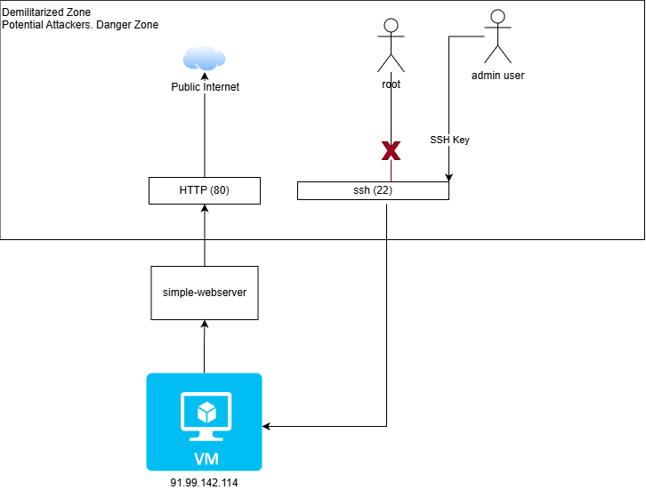

## vm-exmaple
documentation for vm




## SSH Hardening Guide

**Objective**: Harden a Linux VM's SSH access using OpenSSH, public key authentication, 2FA, and Fail2Ban.

---

### 1. SSH Service Hardening (`/etc/ssh/sshd_config`)

* **Disable root login**:
  Create a sudo-capable user (`useradd -m -U -s /bin/bash -G sudo <user>`)
  Set `PermitRootLogin no`

* **Session timeout**:

  ```bash
  ClientAliveInterval 300
  ClientAliveCountMax 1
  ```

* **Restrict user access**:

  ```bash
  AllowUsers <user1> <user2>
  ```

* **Change default port** (optional for obscurity):

  ```bash
  Port <custom_port>
  ```

* **Limit failed attempts**:

  ```bash
  MaxAuthTries 2
  ```

* **Disable unused SSH features**:

  ```bash
  AllowTcpForwarding no
  X11Forwarding no
  AllowAgentForwarding no
  AuthorizedKeysFile .ssh/authorized_keys
  ```

* **Validate and reload**:

  ```bash
  sshd -t
  # Debian/Ubuntu service name is 'ssh'
  systemctl restart ssh
  # On RHEL/CentOS/Alma/Rocky/Amazon Linux it may be 'sshd'
  # systemctl restart sshd
  ```

---

### 2. Fail2Ban Setup

* **Install and enable**:

  ```bash
  apt install fail2ban
  systemctl enable fail2ban
  ```

* **Configure jail**:

  ```bash
  cp /etc/fail2ban/jail.conf /etc/fail2ban/jail.local
  ```

  Modify `[sshd]` block in `jail.local`:

  ```bash
  enabled = true
  port = <custom_port>
  bantime = 600
  findtime = 600
  maxretry = 3
  ```

  Apply config:

  ```bash
  systemctl restart fail2ban
  ```

---

### 3. Certificate-Based Authentication

* **Generate key pair on client**:

  ```bash
  ssh-keygen -b 4096
  ```

* **Transfer public key to server**:

  ```bash
  ssh-copy-id -i ~/.ssh/id_rsa.pub -p <custom_port> user@host
  ```

* **Server config**:

  ```bash
  PubkeyAuthentication yes
  PasswordAuthentication no  # only if not using 2FA
  ```

* **Optional user-specific password disable**:

  ```bash
  Match User <user>
      PasswordAuthentication no
  ```

---

### 4. Two-Factor Authentication (2FA)

* **Install PAM module**:

  ```bash
  apt install libpam-google-authenticator
  ```

* **Initialize 2FA per user**:

  ```bash
  google-authenticator
  ```

* **PAM config (`/etc/pam.d/sshd`)**:

  ```bash
  #@include common-auth
  auth required pam_google_authenticator.so
  ```

* **SSH config updates**:

  ```bash
  ChallengeResponseAuthentication yes
  UsePAM yes
  AuthenticationMethods publickey,keyboard-interactive
  ```

* **Restart SSH**:

  ```bash
  systemctl restart sshd
  ```

---

### Notes:

* Verify all changes with `sshd -t` before applying.
* Keep at least one terminal open when making changes to avoid lockout.
* Store `.google_authenticator` emergency codes securely.

---

### 5. Passwordless Sudo User

Objective: Allow a specific administrative user to run sudo commands without entering a password, while keeping principle of least privilege.

* **Create user (if not existing)**:

  ```bash
  useradd -m -U -s /bin/bash -G sudo <adminuser>
  passwd -l <adminuser>   # lock password if only key auth
  ```

* **Add SSH key for user** (from existing hardened steps): ensure `~<adminuser>/.ssh/authorized_keys` present with correct perms (700 dir, 600 file).

* **Add sudoers drop-in** (preferred):

  ```bash
  visudo -f /etc/sudoers.d/90-<adminuser>
  ```

  Contents:
  ```bash
  <adminuser> ALL=(ALL:ALL) NOPASSWD:ALL
  ```

  This grants passwordless sudo for all commands. To restrict, enumerate commands instead of `ALL`:
  ```bash
  <adminuser> ALL=(ALL:ALL) NOPASSWD:/usr/bin/systemctl,/usr/bin/journalctl
  ```

* **Validate syntax**:
  ```bash
  visudo -c
  ```

* **Security notes**:
  * Use passwordless sudo only for automation / tightly controlled admin accounts.
  * Keep SSH key secure (use ed25519, optional passphrase + agent).
  * Avoid granting NOPASSWD to broad user groups.
  * Audit with: `grep -r NOPASSWD /etc/sudoers*`.

* **Test**:
  ```bash
  sudo -l -U <adminuser>
  sudo whoami   # should output root without password prompt
  ```

---
### Example: User `exmaple`

1. Create user and lock password (key-only):
```bash
useradd -m -U -s /bin/bash -G sudo exmaple
passwd -l exmaple
```

2. Add SSH key (run as root or existing sudo user after copying public key to `/tmp/exmaple.pub`):
```bash
mkdir -p /home/exmaple/.ssh
chmod 700 /home/exmaple/.ssh
cat /tmp/exmaple.pub >> /home/exmaple/.ssh/authorized_keys
chmod 600 /home/exmaple/.ssh/authorized_keys
chown -R exmaple:exmaple /home/exmaple/.ssh
```

3. Grant passwordless sudo:
```bash
visudo -f /etc/sudoers.d/90-exmaple
```
Insert:
```bash
exmaple ALL=(ALL:ALL) NOPASSWD:ALL
```

4. Validate and test:
```bash
visudo -c
sudo -l -U exmaple
sudo -u exmaple sudo whoami
```

If you see: `/etc/sudoers.d/90-exmaple: bad permissions, should be mode 0440` fix ownership & permissions:
```bash
sudo chown root:root /etc/sudoers.d/90-exmaple
sudo chmod 0440 /etc/sudoers.d/90-exmaple
sudo visudo -c   # re-check
```
Required mode 0440 ensures the file is readable by root and not writable (preventing accidental edits or privilege escalation). Avoid 0644 or executable bits; sudo will warn or ignore insecure files.

5. Optional restriction (replace previous line if limiting to systemctl & journalctl only):
```bash
exmaple ALL=(ALL:ALL) NOPASSWD:/usr/bin/systemctl,/usr/bin/journalctl
```

---